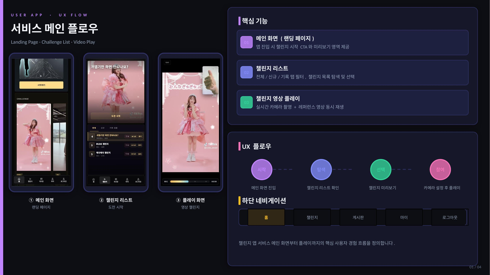
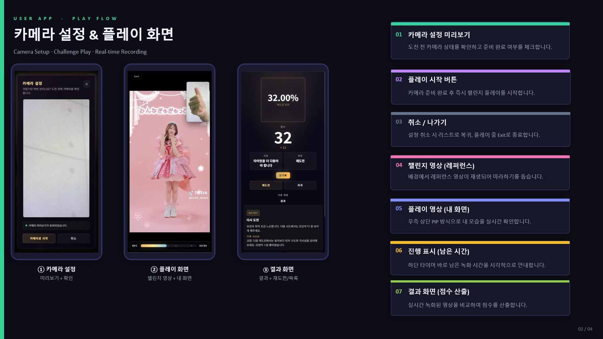
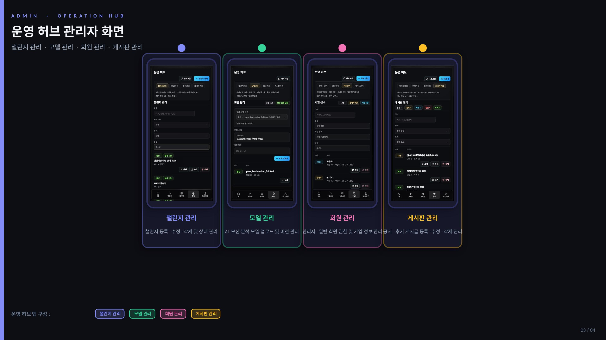
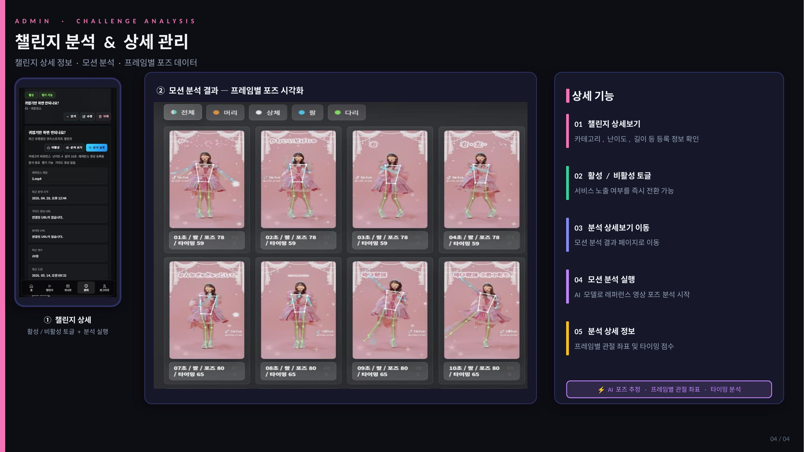

# Mocha

모션 챌린지 영상을 따라 하고, 사용자 시도 영상과 기준 영상을 비교해 점수 피드백을 제공하는 모션 챌린지 플랫폼입니다.

## 프로젝트 소개

Mocha는 사용자가 챌린지를 선택하고 기준 동작을 확인한 뒤, 자신의 시도 영상을 업로드해 처리 상태와 결과 점수를 확인할 수 있는 웹 서비스입니다. 단순 영상 업로드가 아니라 `챌린지 탐색 -> 시도 업로드 -> 처리 진행률 확인 -> 결과 확인 -> 개인 이력 조회`로 이어지는 경험을 중심으로 설계했습니다.

관리자 화면에서는 챌린지 생성/수정, 활성 상태 관리, 기준 영상 분석, 모델 자산 관리가 가능하도록 사용자 기능과 운영 기능을 분리했습니다.

## 주요 화면

<details>
<summary><b>사용자 흐름 화면 보기</b></summary>

### UX Flow



### Play Flow



</details>

<details>
<summary><b>관리자/분석 화면 보기</b></summary>

### 운영 허브



### 챌린지 분석



</details>

## 주요 기능

### 사용자

- 활성 챌린지 목록 및 상세 조회
- 기준 영상 확인 후 시도 영상 업로드
- 처리 진행률과 결과 점수 확인
- 개인 시도 이력 조회
- 세션 기반 회원가입, 로그인, 로그아웃

### 관리자

- 관리자 로그인 및 권한 분리
- 챌린지 생성, 수정, 삭제
- 챌린지 활성/비활성 토글
- 기준 영상 레퍼런스 분석 실행
- 모델 자산 관리

## 기술 스택

| 영역 | 기술 |
| --- | --- |
| Frontend | React 18, TypeScript, Vite, React Router, Vitest |
| Backend | Java 21, Spring Boot 3.3, Spring Security, Spring Data JPA |
| Analysis Bridge | Python, FastAPI, MediaPipe, OpenCV, NumPy |
| Database | MySQL 8.4, H2 Test Profile |
| Infra / Tool | Docker Compose, Redis, Git/GitHub |

## 담당 구현

- 공개 사용자 UX와 관리자 UX를 분리한 라우팅/레이아웃 구조 설계
- 챌린지/시도 기록 도메인 모델링
- 시도 업로드, 처리 진행률, 결과 조회, 이력 조회 흐름 구현
- 세션 기반 인증과 `USER`/`ADMIN` 역할 분리
- `/api/admin/**` 관리자 API 보호 정책 구성
- MySQL 런타임 프로필과 H2 테스트 프로필 분리
- MediaPipe 분석 기능을 FastAPI 브리지로 분리

## 핵심 구현과 해결한 문제

### 업로드 -> 처리 -> 결과 조회 흐름

업로드와 결과 확인이 분리되면 사용자가 자신의 시도 상태를 알기 어렵다고 판단했습니다. 시도를 작업 상태로 모델링하고, 업로드 이후 처리 진행률과 결과 조회를 하나의 흐름으로 연결했습니다.

### 관리자 기능 분리

MVP 단계에서도 운영 기능은 일반 사용자 기능과 분리되어야 한다고 보고, `USER`/`ADMIN` 역할과 관리자 전용 API 경로를 구성했습니다.

### MediaPipe 분석 브리지 분리

비디오/포즈 분석을 Spring Boot에 직접 결합하면 의존성과 배포가 복잡해질 수 있어, MediaPipe 분석을 FastAPI 브리지로 분리했습니다. 백엔드는 HTTP로 분석 요청을 보내고, 분석 로직은 독립적으로 수정할 수 있도록 구성했습니다.

### 로컬 환경 설정 문제

Docker MySQL 계정과 백엔드 MySQL 프로필이 맞지 않아 접속 오류가 발생할 수 있어, `.env.example`을 기준으로 환경변수와 Docker 설정을 맞추도록 정리했습니다.

## 실행 방법

### 0. 환경 준비

- Java 21
- Node.js + npm
- Docker Desktop 권장: MySQL/Redis 실행용
- Python 환경: MediaPipe Bridge 실행용

### 1. 환경변수 준비

```powershell
copy .env.example .env
```

예시 값은 [.env.example](.env.example)을 참고하세요.

### 2. MySQL/Redis 실행

```powershell
docker compose up -d
```

### 3. Backend 실행

```powershell
cd backend
.\gradlew.bat bootRun --args='--spring.profiles.active=mysql'
```

백엔드는 기본적으로 `http://localhost:8080`에서 실행됩니다.

### 4. Frontend 실행

```powershell
cd frontend
npm.cmd install
npm.cmd run dev
```

프론트엔드는 기본적으로 `http://localhost:5173`에서 실행됩니다.

### 5. MediaPipe Bridge 실행

브리지는 선택 기능이며 `.task` 모델 파일이 필요합니다.

```powershell
cd mediapipe-bridge
.\run-bridge.ps1
```

모델 경로를 직접 지정하려면 다음처럼 실행합니다.

```powershell
$env:MEDIAPIPE_BRIDGE_MODEL_PATH='C:\path\to\pose_landmarker_heavy.task'
cd mediapipe-bridge
.\run-bridge.ps1
```

브리지는 기본적으로 `http://localhost:8000`에서 실행됩니다.

## 디렉터리

| 경로 | 설명 |
| --- | --- |
| `backend/` | Spring Boot API 서버 |
| `frontend/` | React + Vite 웹 애플리케이션 |
| `mediapipe-bridge/` | MediaPipe 처리용 FastAPI 브리지 |
| `motion-calibration/` | 모션 분석 보정 실험 영역 |
| `docs/` | README에 사용되는 스크린샷 |