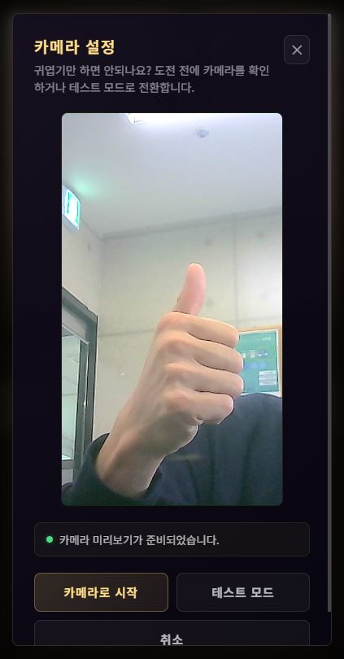
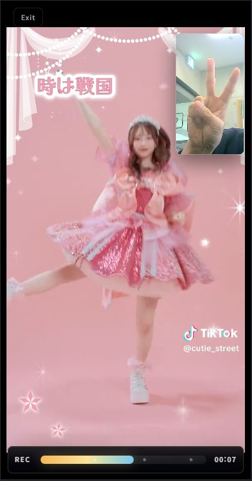
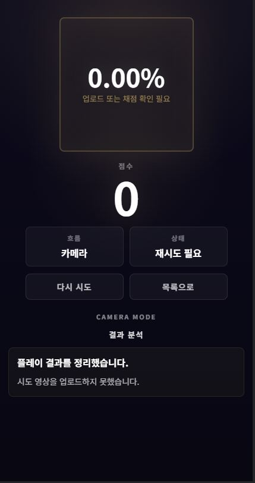
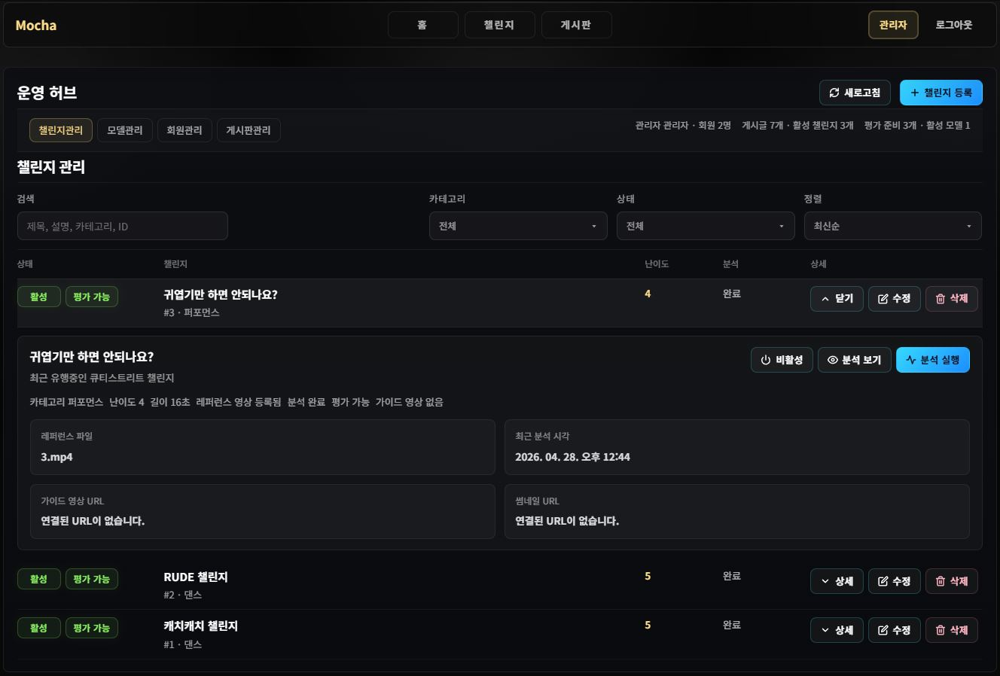
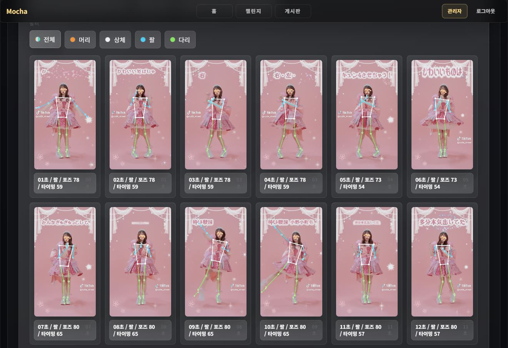

# Mocha

짧고 반복 가능한 **모션(동작) 챌린지**를 선택해 시도 영상을 업로드하고, 처리 결과(점수/분석)를 확인하는 **웹 기반 챌린지 플랫폼**입니다.  
공개 사용자 UX(탐색·참여·이력)와 관리자 UX(챌린지·모델 자산 운영)를 분리해, MVP 단계에서도 운영이 가능한 형태로 구성했습니다.

- **사용자 흐름**: 챌린지 탐색 → 상세/레퍼런스 확인 → 로그인 → 시도 업로드 → 진행률/결과 확인 → 개인 이력 조회
- **관리자 흐름**: 관리자 로그인 → 챌린지 CRUD/활성 토글 → 모델 자산 관리 → 레퍼런스 분석 실행

## 목차

- [프로젝트 소개](#프로젝트-소개)
- [주요 기능](#주요-기능)
- [기술 스택](#기술-스택)
- [담당 역할 (개인 프로젝트)](#담당-역할-개인-프로젝트)
- [핵심 구현](#핵심-구현)
- [트러블슈팅](#트러블슈팅)
- [실행 방법](#실행-방법)
- [화면 이미지](#화면-이미지)
- [저장소 구조](#저장소-구조)

바로 시작하기(로컬)

```powershell
# 0) (권장) 환경변수 파일 준비
copy .env.example .env

# 1) MySQL/Redis (선택: 도커)
docker compose up -d

# 2) Backend
cd backend
.\gradlew.bat bootRun --args='--spring.profiles.active=mysql'

# 3) Frontend
cd ..\frontend
npm.cmd install
npm.cmd run dev
```

기본 포트

- **Frontend**: `http://localhost:5173`
- **Backend**: `http://localhost:8080`
- **MediaPipe Bridge(선택)**: `http://localhost:8000`

---

<a id="프로젝트-소개"></a>
## 프로젝트 소개

Mocha는 “짧게 따라 하고 바로 피드백 받는” 경험에 집중한 모션 챌린지 웹 플랫폼입니다.  
활성화된 챌린지만 노출하고(공개 UX), 시도 데이터는 회원에게 귀속되며(이력), 운영 기능은 **REST/CRUD 기본형**으로 시작해 확장 가능성을 확보했습니다.

- 제품 범위/비목표: [docs/PRODUCT.md](docs/PRODUCT.md)
- 구조/모듈 맵: [docs/ARCHITECTURE.md](docs/ARCHITECTURE.md)

<a id="주요-기능"></a>
## 주요 기능

- **공개 사용자**
  - 활성 챌린지 목록/상세 조회
  - 레퍼런스 프리뷰 확인
- **로그인 사용자**
  - 세션 기반 회원가입/로그인/로그아웃, `me` 조회
  - 챌린지 시도 시작 → 영상 업로드 → 처리 진행률/결과 확인
  - 개인 시도 이력 조회
- **관리자(운영)**
  - 챌린지 생성/수정/삭제, 활성/비활성 토글
  - 모델 자산 관리
  - 챌린지 기준 영상(레퍼런스) 분석 실행

<a id="기술-스택"></a>
## 기술 스택

- **Frontend**: React 18, TypeScript, Vite, React Router, Vitest
- **Backend**: Java 21, Spring Boot 3.3, Spring MVC, Spring Data JPA, Spring Security, OAuth2 Client, Actuator
- **Bridge(선택)**: Python, FastAPI, Uvicorn, MediaPipe, OpenCV, NumPy
- **Infra(Local)**: MySQL 8.4, Redis 7.4 (`docker-compose.yml`)
- **Test**: H2(테스트 프로필), Spring Boot Test, Spring Security Test

<a id="담당-역할-개인-프로젝트"></a>
## 담당 역할 (개인 프로젝트)

- 공개 UX/관리자 UX를 분리한 라우팅·레이아웃 구조 설계 및 구현
- 챌린지/시도 도메인 모델링, 업로드→처리→결과/이력 조회의 end-to-end 흐름 구현
- 세션 기반 인증과 `USER`/`ADMIN` 역할 분리, `/api/admin/**` 보호 정책 구성
- MySQL 런타임 프로필과 H2 테스트 프로필 분리로 테스트 안정성 확보
- MediaPipe 기반 분석을 브리지(FastAPI)로 분리해 확장 가능한 처리 경로 마련

<a id="핵심-구현"></a>
## 핵심 구현

### 1) 시도 업로드 → 처리 진행률 → 결과/이력 조회 플로우

- **문제**: 업로드/처리/결과 확인이 분리되면 사용자는 “지금 뭐가 되고 있지?”를 잃기 쉽습니다.
- **해결**: 시도를 “작업(job) 상태”로 모델링하고, 진행률과 결과를 한 흐름으로 연결했습니다.
- **결과**: 업로드 이후에도 사용자는 처리 상태를 추적할 수 있고, 완료 후 결과와 이력이 자연스럽게 이어집니다.

### 2) 세션 인증 + 관리자 경로 분리

- **문제**: MVP 단계에서도 운영 기능은 반드시 보호되어야 합니다.
- **해결**: 세션 기반 인증을 중심으로 `USER`/`ADMIN` 역할을 두고, 관리자 쓰기 API를 `/api/admin/**`로 명확히 분리했습니다.
- **결과**: 공개 UX와 운영 UX의 경계가 분명해져 유지보수와 확장이 쉬워졌습니다.

### 3) 처리 파이프라인 분리(브리지)로 확장성 확보

- **문제**: 무거운 비디오/포즈 분석을 백엔드에 직접 결합하면 배포/운영/의존성이 급격히 복잡해집니다.
- **해결**: MediaPipe 분석을 FastAPI 브리지로 분리하고, 백엔드는 HTTP로 요청하는 구조로 확장 경로를 마련했습니다.
- **결과**: 분석 워커/모델 업데이트/성능 튜닝을 백엔드와 독립적으로 진행할 수 있습니다.

<a id="트러블슈팅"></a>
## 트러블슈팅

### 로컬에서 MySQL 접속 실패(Access denied) / 설정이 꼬이는 문제

- **증상**: 백엔드 실행 시 DB 연결 오류가 나거나, 도커의 MySQL 계정과 백엔드 계정이 맞지 않아 접속이 실패합니다.
- **원인(자주 발생하는 케이스)**:
  - `docker-compose.yml` 기본값은 `MYSQL_USER=motion`, `MYSQL_PASSWORD=motion`인데,
  - 백엔드의 MySQL 프로필(`[backend/src/main/resources/application-mysql.yml](backend/src/main/resources/application-mysql.yml)`) 또는 로컬 `.env` 값이 서로 다르면 연결이 실패합니다.
- **해결**:
  - 가장 단순한 방법: `.env.example`을 복사해 `.env`를 만들고(루트), **도커 MySQL 설정과 동일하게** `MYSQL_*` 값을 맞춥니다.
  - 또는 도커를 쓰지 않는다면, 본인 로컬 MySQL 계정/비밀번호에 맞춰 `.env` 또는 `application-mysql.yml`을 일관되게 맞춥니다.
- **배운점**: 로컬 실행에서 가장 큰 비용은 “코드”보다 “환경 불일치”입니다. 도커/프로필/환경변수의 단일 소스(Single Source of Truth)를 유지하면 시행착오가 줄어듭니다.

<a id="실행-방법"></a>
## 실행 방법

자세한 개발 가이드는 [docs/DEVELOPMENT.md](docs/DEVELOPMENT.md)를 참고하세요.

### 0) 환경 준비

- Java 21
- Node.js + npm
- (권장) Docker Desktop: MySQL/Redis를 빠르게 띄우기
- (선택) Python 환경: `mediapipe-bridge` 실행용

### 0-1) 환경변수(.env) 준비(권장)

백엔드는 실행 시 `.env` 파일을 자동으로 읽을 수 있습니다(옵션):

- `./.env`
- `./backend/.env`

가장 빠른 시작:

```powershell
copy .env.example .env
```

예시 값은 [.env.example](.env.example)을 참고하세요.

### 1) MySQL/Redis (권장: 도커)

```powershell
docker compose up -d
```

### 2) Backend (Spring Boot)

```powershell
cd backend
.\gradlew.bat bootRun --args='--spring.profiles.active=mysql'
```

### 3) Frontend (React + Vite)

```powershell
cd frontend
npm.cmd install
npm.cmd run dev
```

### 4) MediaPipe Bridge (선택)

브리지는 `.task` 모델 파일이 필요합니다. 기본 후보 파일을 `mediapipe-bridge/models/`에서 탐색하며, 필요 시 환경변수로 경로를 지정할 수 있습니다.

```powershell
cd mediapipe-bridge
.\run-bridge.ps1
```

모델 경로를 직접 지정하려면:

```powershell
$env:MEDIAPIPE_BRIDGE_MODEL_PATH='C:\path\to\pose_landmarker_heavy.task'
cd mediapipe-bridge
.\run-bridge.ps1
```

소셜 로그인(OAuth2)을 붙이려면: [docs/SOCIAL_AUTH_SETUP.md](docs/SOCIAL_AUTH_SETUP.md)

<a id="화면-이미지"></a>
## 화면 이미지

스크린샷은 `docs/screenshots/`에 두고, README에서는 **필요할 때만 펼쳐서** 확인할 수 있도록 정리했습니다.

<details>
<summary><b>사용자 흐름 스크린샷 보기</b></summary>

<table>
  <tr>
    <td align="center" width="50%">
      <b>챌린지 목록</b><br />
      활성 챌린지 탐색 진입점<br /><br />
      
    </td>
    <td align="center" width="50%">
      <b>시도 업로드/카메라 확인</b><br />
      촬영/업로드 단계 진입<br /><br />
      
    </td>
  </tr>
  <tr>
    <td align="center" width="50%">
      <b>챌린지 상세/참여</b><br />
      상세 정보·레퍼런스 확인 후 시작<br /><br />
      
    </td>
    <td align="center" width="50%">
      <b>시도 결과</b><br />
      처리 완료 후 점수/결과 확인<br /><br />
      
    </td>
  </tr>
</table>

</details>

<details>
<summary><b>관리자(운영) 스크린샷 보기</b></summary>

- **챌린지 관리**: CRUD 및 활성/비활성 토글  
  
- **챌린지 분석**: 기준 영상 분석 실행/관리  
  

</details>

---

<a id="저장소-구조"></a>
## 저장소 구조

```text
backend/            Spring Boot API
frontend/           React + Vite 웹 앱
mediapipe-bridge/   MediaPipe 처리용 FastAPI 브리지(선택)
docs/               기준 문서(제품/아키텍처/개발 가이드 등)
```
